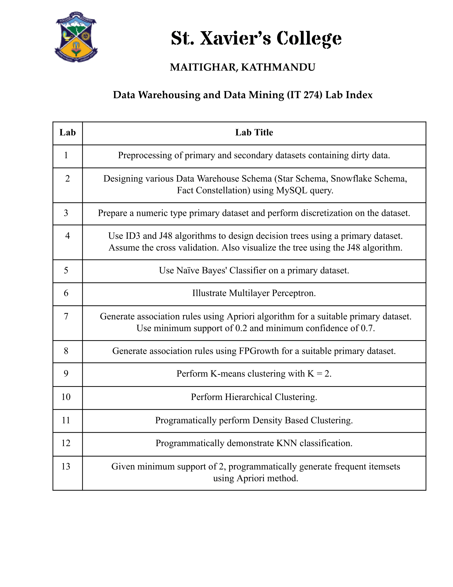

# Data Mining Laboratory Work

This repository contains the complete set of laboratory exercises completed as part of the Data Warehousing and Data Mining course. It includes datasets, trained machine learning models, experiment outputs, preview images, and the compiled laboratory report in PDF format.

## Overview

This repository documents practical implementations of major data mining techniques using WEKA (v3.9.6) and supporting tools. Each laboratory exercise demonstrates algorithm workflow, preprocessing steps, evaluation methods, and output interpretation.

The repository includes:
- ARFF and CSV dataset files
- Trained model files (Naive Bayes, MLP, etc.)
- Experiment outputs (CSV and text files)
- Index preview image
- Full consolidated PDF laboratory report

## Laboratory Topics Covered

1. **Data Preprocessing**
   - Handling missing values
   - Attribute selection
   - Data transformation and formatting
   - ARFF dataset creation

2. **Classification Algorithms**
   - ID3
   - Naive Bayes
   - Multilayer Perceptron (MLP)
   - Model training, testing, and evaluation

3. **Association Rule Mining**
   - Apriori
   - FP-Growth
   - Evaluation of rule confidence and support

4. **Clustering**
   - K-Means clustering
   - Hierarchical clustering
   - Result analysis and visualization


### Index Preview


## Viewing the PDF Report in GitHub


You can open the full lab report here:

**[Click to View Labreps.pdf](Labreps.pdf)**

## Tools and Technologies Used

- WEKA 3.9.6,3.8.6
- Python (NumPy, Matplotlib)
- Microsoft Excel 

## Installation and Setup

### WEKA Setup (Labs 1–10)

1. Download WEKA 3.9.6  
   https://waikato.github.io/weka-wiki/downloading_weka/
2. Install necessary WEKA packages:  
   Tools → Package Manager → Install “simpleEducationalLearningSchemes”
3. Load datasets:  
   Explorer → Open File → Select .arff or .csv
4. Load pre-trained models:  
   Classify → Right-click → Load Model → Select .model file

### Python Setup (Labs 11–13)

1. Install Python 3.x from https://www.python.org
2. Install dependencies:
   ```bash
   pip install numpy matplotlib
   ```
3. Run Python implementations:
   ```bash
   python dbscan_clustering.py
   python knn_classification.py
   python apriori_algorithm.py
   ```

---


